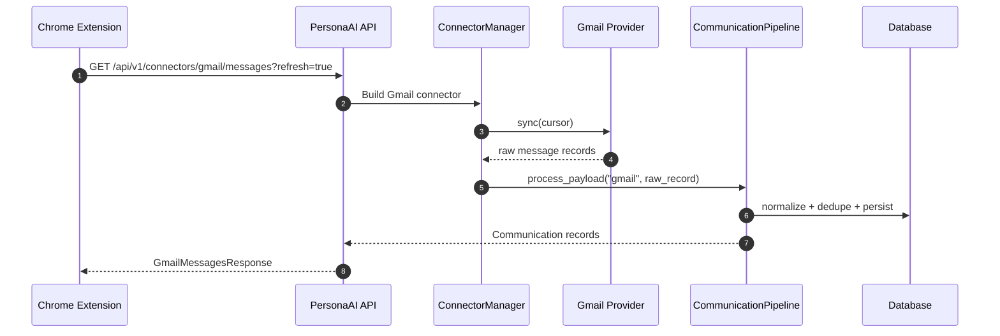
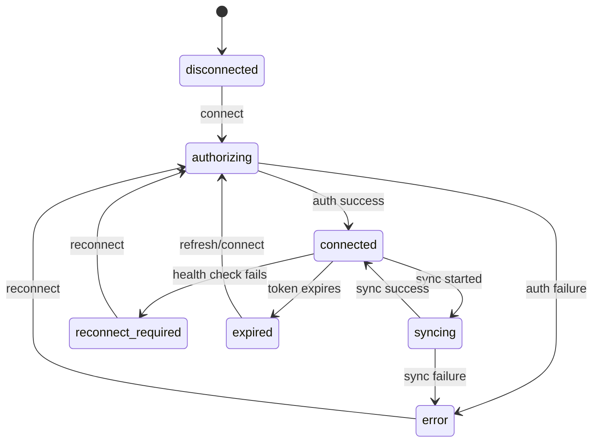

# Chrome Extension API Contract

This document defines the API surface a Chrome Extension can use to talk to PersonaAI without reading backend source code.

Scope:
- Authentication and token refresh
- Required headers and tracing headers
- Extension-relevant endpoints
- Request and response schemas
- Error handling and rate limits
- Sync workflow and connector state transitions
- Offline handling guidance
- Example API calls

Base path:
- Local/dev: `http://localhost:8000`
- Versioned API: `/api/v1`

Primary auth model:
- Access token: JWT bearer token
- Refresh token: JWT refresh token with rotation support

Recommended extension strategy:
- Store access and refresh tokens securely in extension storage.
- Attach `Authorization: Bearer <access_token>` to every protected request.
- Refresh the access token on `401` before retrying the original request once.

## Table Of Contents

- [1. Contract Overview](#1-contract-overview)
- [2. Authentication Flow](#2-authentication-flow)
- [3. Required Headers](#3-required-headers)
- [4. Error Model](#4-error-model)
- [5. Extension-Relevant Endpoints](#5-extension-relevant-endpoints)
- [6. Request and Response Schemas](#6-request-and-response-schemas)
- [7. Sync Workflow](#7-sync-workflow)
- [8. Connector State Transitions](#8-connector-state-transitions)
- [9. Offline Handling](#9-offline-handling)
- [10. Example API Calls](#10-example-api-calls)
- [11. Recommended Call Sequences](#11-recommended-call-sequences)

## 1. Contract Overview

PersonaAI is a backend that authenticates a user, connects external providers such as Gmail, normalizes platform messages into a common `Communication` model, and exposes those communications back to clients.

For a Chrome Extension, the backend is most useful in four areas:

1. Sign the user in and keep tokens fresh.
2. Connect Gmail and trigger syncs.
3. Read normalized messages and search them.
4. Read extension context and optional assistant responses.

The extension should treat the backend as a stateful API with short-lived access tokens, long-lived refresh tokens, and online-only sync operations.

## 2. Authentication Flow

### 2.1 Login

Authentication starts with Google sign-in.

Endpoint:
- `POST /api/v1/auth/google`

Request body:
- `id_token` from Google OAuth / Google Identity

Response:
- `access_token`
- `refresh_token`
- `token_type` set to `bearer`

The backend validates the Google token, looks up or creates the user, and returns PersonaAI JWTs. The extension should persist both tokens and use the access token for subsequent requests.

### 2.2 JWT Usage

The backend validates JWTs in `get_current_user`:
- The token must be present in the `Authorization` header.
- The token must be an `access` token.
- The token subject must be a valid UUID.
- The corresponding user must exist.

Access token lifetime:
- 15 minutes by default

Refresh token lifetime:
- 7 days by default

### 2.3 Refresh

Endpoint:
- `POST /api/v1/auth/refresh`

Request body:
- `refresh_token`

Response:
- New `access_token`
- New `refresh_token`
- `token_type` set to `bearer`

This is a refresh-token rotation flow. The extension should replace the stored refresh token every time the refresh endpoint succeeds.

### 2.4 Logout

Endpoint:
- `POST /api/v1/auth/logout`

Request body:
- `refresh_token`

Effect:
- Revokes the refresh token on the backend

The extension should clear local credentials after logout.

### 2.5 Protected Request Behavior

If a protected endpoint returns `401`:
1. Pause the original request.
2. Call `POST /api/v1/auth/refresh`.
3. Update stored tokens.
4. Retry the original request once.
5. If refresh fails, force the user back to sign-in.

## 3. Required Headers

### 3.1 Mandatory Headers

For authenticated requests:
- `Authorization: Bearer <access_token>`
- `Content-Type: application/json` for requests with JSON bodies

### 3.2 Tracing Headers

The backend accepts and echoes request tracing headers:
- `X-Request-ID`
- `X-Correlation-ID`
- `X-User-ID`

Behavior:
- If `X-Request-ID` is omitted, the backend generates one.
- If `X-Correlation-ID` is omitted, the backend uses the request ID.
- `X-User-ID` is optional and used only for request context tracing.
- The response includes `X-Request-ID` and `X-Correlation-ID`.

### 3.3 Response Headers

The backend also returns:
- `X-Process-Time`

This is useful for diagnosing slow syncs from the extension.

## 4. Error Model

### 4.1 Success Envelope

Successful responses use:

```json
{
  "success": true,
  "message": "OK",
  "data": {}
}
```

### 4.2 Error Envelope

Errors use:

```json
{
  "success": false,
  "message": "Request validation failed",
  "error": "validation_error",
  "details": [],
  "request_id": "..."
}
```

### 4.3 Common Error Codes

- `authentication_error`
- `authorization_error`
- `validation_error`
- `http_error`

### 4.4 Typical HTTP Status Codes

- `400` bad request
- `401` unauthorized
- `403` forbidden
- `404` not found
- `422` validation failed
- `429` rate limited
- `500` unexpected server error

### 4.5 Extension Guidance

The extension should:
- Treat `401` as expired or missing access token.
- Treat `403` as a blocked or inactive account, or a route-specific authorization failure.
- Treat `422` as a client bug or malformed payload.
- Treat `429` as a retryable throttling condition.
- Treat `500` as a transient server failure unless the response says otherwise.

## 5. Extension-Relevant Endpoints

### 5.1 Health

| Method | URL | Auth | Purpose |
| --- | --- | --- | --- |
| `GET` | `/health` | No | Overall app health |
| `GET` | `/api/v1/health` | No | Versioned health check |
| `GET` | `/api/v1/auth/health` | No | Auth subsystem health |

Use:
- Start-up checks
- Diagnostics
- Retry gating for extension sync actions

### 5.2 Authentication

| Method | URL | Auth | Purpose |
| --- | --- | --- | --- |
| `POST` | `/api/v1/auth/google` | No | Exchange Google ID token for PersonaAI JWTs |
| `POST` | `/api/v1/auth/refresh` | No | Rotate refresh token and mint fresh JWTs |
| `POST` | `/api/v1/auth/logout` | No | Revoke refresh token |
| `POST` | `/api/v1/auth/verify-email` | No | Placeholder verification flow |
| `POST` | `/api/v1/auth/resend-verification` | No | Placeholder resend flow |

### 5.3 User Profile

| Method | URL | Auth | Purpose |
| --- | --- | --- | --- |
| `GET` | `/api/v1/users/me` | Yes | Read profile and settings |
| `PATCH` | `/api/v1/users/me` | Yes | Update profile or settings |

### 5.4 Connectors

| Method | URL | Auth | Purpose |
| --- | --- | --- | --- |
| `GET` | `/api/v1/connectors` | Yes | List user connectors and available platforms |
| `GET` | `/api/v1/connectors/metrics` | Yes | Aggregate sync metrics |
| `GET` | `/api/v1/connectors/gmail/auth-url` | Yes | Get Gmail OAuth authorization URL |
| `POST` | `/api/v1/connectors/{platform}/connect` | Yes | Connect a platform |
| `POST` | `/api/v1/connectors/{platform}/disconnect` | Yes | Disconnect a platform |
| `POST` | `/api/v1/connectors/{platform}/sync` | Yes | Trigger manual sync |
| `GET` | `/api/v1/connectors/{platform}/messages` | Yes | Read Gmail inbox messages |
| `GET` | `/api/v1/connectors/{platform}/health` | Yes | Check connector health |

Notes:
- `messages` is currently implemented for Gmail.
- `platform` should be `gmail` for the inbox contract.
- Gmail onboarding uses `GET /api/v1/connectors/gmail/auth-url` and backend callback handling.
- `POST /api/v1/connectors/gmail/connect` is deprecated for Gmail and returns `410 Gone`.

### 5.5 Communications

| Method | URL | Auth | Purpose |
| --- | --- | --- | --- |
| `GET` | `/api/v1/communications` | Yes | List normalized communications |
| `GET` | `/api/v1/communications/search` | Yes | Search normalized communications |
| `GET` | `/api/v1/communications/recent` | Yes | Fetch recent communications |
| `GET` | `/api/v1/communications/summary` | Yes | Aggregate message summary |
| `GET` | `/api/v1/communications/{id}` | Yes | Fetch a single communication |

### 5.6 Extension API

| Method | URL | Auth | Purpose |
| --- | --- | --- | --- |
| `GET` | `/api/v1/extension/context` | Yes | Read extension context hints |
| `POST` | `/api/v1/extension/chat` | Yes | Send a chat message to the sidebar assistant |

## 6. Request and Response Schemas

### 6.1 Auth Schemas

#### `GoogleLoginRequest`

```json
{
  "id_token": "google-id-token"
}
```

#### `RefreshRequest`

```json
{
  "refresh_token": "refresh-token"
}
```

#### `TokenResponse`

```json
{
  "access_token": "jwt-access-token",
  "refresh_token": "jwt-refresh-token",
  "token_type": "bearer"
}
```

### 6.2 User Schemas

#### `UserRead`

Key fields:
- `id`
- `email`
- `role`
- `status`
- `is_verified`
- `created_at`
- `updated_at`
- `last_login`
- `profile`
- `settings`

Useful nested settings for the extension:
- `settings.ai_personality`
- `settings.memory_enabled`
- `settings.theme`
- `settings.language`
- `settings.timezone`

### 6.3 Connector Schemas

#### `ConnectRequest`

```json
{
  "auth_data": {
    "code": "oauth-code"
  }
}
```

Other supported shape:

```json
{
  "auth_data": {
    "access_token": "already-issued-token",
    "refresh_token": "optional-refresh-token",
    "expires_in": 3600
  }
}
```

#### `ConnectResponse`

```json
{
  "id": "connector-uuid",
  "platform": "gmail",
  "state": "connected"
}
```

#### `SyncResultResponse`

```json
{
  "status": "success",
  "messages_imported": 12,
  "attachments_imported": 3,
  "error": null
}
```

#### `MetricsResponse`

```json
{
  "connected_accounts": 1,
  "total_syncs": 8,
  "failed_syncs": 1,
  "messages_imported": 140,
  "avg_sync_time_seconds": 2.54
}
```

### 6.4 Gmail Message Schema

`GET /api/v1/connectors/gmail/messages` returns:

```json
{
  "messages": [
    {
      "id": "gmail-message-stub-id",
      "communication_id": "communication-uuid",
      "platform_message_id": "gmail-platform-message-id",
      "thread_id": "thread-id-or-null",
      "subject": "Invoice for June",
      "body": "Plain text body",
      "sender_name": "Acme Billing <billing@acme.com>",
      "sender_address": "billing@acme.com",
      "recipient_address": "user@example.com",
      "attachments": [
        {
          "id": "attachment-uuid",
          "name": "invoice.pdf",
          "content_type": "application/pdf",
          "size_bytes": 12345
        }
      ],
      "created_at": "2026-06-30T10:42:16+05:30",
      "labels": ["INBOX", "UNREAD"],
      "snippet": "Your June invoice is attached",
      "unread": true
    }
  ],
  "next_cursor": null
}
```

Important:
- The field is `created_at`, not `date`.
- `created_at` is an ISO 8601 string.

### 6.5 Communication Schema

`GET /api/v1/communications`, `recent`, `search`, and `/{id}` return normalized communications:

```json
{
  "id": "communication-uuid",
  "platform": "gmail",
  "platform_message_id": "gmail-platform-message-id",
  "subject": "Invoice for June",
  "body": "Plain text body",
  "html_body": "<p>...</p>",
  "status": "new",
  "importance": "medium",
  "created_at": "2026-06-30T10:42:16+05:30",
  "sender_name": "Acme Billing",
  "sender_address": "billing@acme.com",
  "receivers": ["user@example.com"],
  "attachments": [
    {
      "id": "attachment-uuid",
      "name": "invoice.pdf",
      "content_type": "application/pdf",
      "url": null,
      "size_bytes": 12345
    }
  ],
  "metadata": {
    "thread_id": "thread-id",
    "labels": ["INBOX"],
    "snippet": "Your June invoice is attached",
    "unread": true
  }
}
```

### 6.6 Extension Context Schema

`GET /api/v1/extension/context` returns:

```json
{
  "ai_personality": "professional",
  "sync_interval_minutes": 15,
  "auto_summarize_enabled": true
}
```

### 6.7 Chat Schema

`POST /api/v1/extension/chat` request:

```json
{
  "message": "Summarize the last three messages"
}
```

Response:

```json
{
  "reply": "Hello! This is a mock AI response to your query: 'Summarize the last three messages'."
}
```

## 7. Sync Workflow

### 7.1 Gmail Sync Sequence



### 7.2 Manual Sync Endpoint

Use `POST /api/v1/connectors/gmail/sync` when the extension wants an explicit sync job result.

Behavior:
- Loads the connector
- Reads the stored checkpoint cursor
- Streams raw Gmail records
- Runs each record through the communication pipeline
- Updates sync history and checkpoint state

Returned data:
- Counts of imported messages and attachments
- Final status
- Error message if the sync failed

### 7.3 Read-Only Messages Endpoint

Use `GET /api/v1/connectors/gmail/messages` when the extension wants to display the inbox.

Behavior:
- Without `refresh=true`, returns stored normalized Gmail messages.
- With `refresh=true`, triggers a sync first, then reads stored messages.

Recommended extension behavior:
- Use `refresh=true` for a user-initiated manual refresh.
- Use `refresh=false` on initial load or background polling.

### 7.4 Backend Side Effects

During sync, the backend may:
- Create or update `communications`
- Create or update `participants`
- Create or update `attachments`
- Create or update `conversations`
- Write sync history rows
- Update sync checkpoints
- Queue AI tasks
- Publish message import events

## 8. Connector State Transitions

The backend stores connector lifecycle state in the `ConnectorState` enum:

- `disconnected`
- `authorizing`
- `connected`
- `syncing`
- `error`
- `expired`
- `reconnect_required`



Extension interpretation:
- `connected`: safe to sync
- `syncing`: a sync is already in progress
- `error`: show a retry/reconnect prompt
- `expired` or `reconnect_required`: prompt the user to reconnect Gmail

## 9. Offline Handling

The backend does not provide an offline mode.

Recommended extension behavior:

1. Cache the last successful message list locally.
2. Cache the last successful user profile and connector metadata.
3. When network calls fail, render cached data with an "offline" badge.
4. Do not trigger sync while offline.
5. Retry with exponential backoff when the browser reports network recovery.
6. If the access token expires while offline, wait until connectivity returns before refreshing.

Suggested fallback order:
- Use fresh API response if available.
- Otherwise use cached inbox data.
- Otherwise show an empty-state with a reconnect prompt.

## 10. Example API Calls

### 10.1 Login

```ts
const response = await fetch('/api/v1/auth/google', {
  method: 'POST',
  headers: { 'Content-Type': 'application/json' },
  body: JSON.stringify({ id_token: googleIdToken }),
});
```

### 10.2 Refresh Tokens

```ts
const response = await fetch('/api/v1/auth/refresh', {
  method: 'POST',
  headers: { 'Content-Type': 'application/json' },
  body: JSON.stringify({ refresh_token: storedRefreshToken }),
});
```

### 10.3 Load Gmail Inbox

```ts
const response = await fetch('/api/v1/connectors/gmail/messages?refresh=true', {
  headers: {
    Authorization: `Bearer ${accessToken}`,
    'X-Request-ID': crypto.randomUUID(),
  },
});
```

### 10.4 Read Normalized Communications

```ts
const response = await fetch('/api/v1/communications?platform=gmail&limit=50', {
  headers: {
    Authorization: `Bearer ${accessToken}`,
  },
});
```

### 10.5 Search Communications

```ts
const response = await fetch(
  '/api/v1/communications/search?platform=gmail&query=invoice&limit=25',
  {
    headers: {
      Authorization: `Bearer ${accessToken}`,
    },
  },
);
```

### 10.6 Read Extension Context

```ts
const response = await fetch('/api/v1/extension/context', {
  headers: {
    Authorization: `Bearer ${accessToken}`,
  },
});
```

## 11. Recommended Call Sequences

### 11.1 Cold Start

1. Load tokens from extension storage.
2. If the access token exists and is likely valid, call `GET /api/v1/users/me`.
3. If the call returns `401`, refresh tokens.
4. After authentication succeeds, load `/api/v1/connectors`.
5. Load `/api/v1/connectors/gmail/messages`.
6. Populate the UI from the returned messages.

### 11.2 User Presses Sync

1. Call `GET /api/v1/connectors/gmail/messages?refresh=true`.
2. If the response succeeds, replace the local inbox state.
3. If the response fails with `401`, refresh and retry once.
4. If the response fails with `429`, back off and retry later.
5. If the response fails with `5xx`, keep cached data and surface a transient error.

### 11.3 Connector Health Check

1. Call `GET /api/v1/connectors/gmail/health`.
2. If healthy, keep the connector in a connected state.
3. If unhealthy, prompt the user to reconnect.

### 11.4 Sign Out

1. Call `POST /api/v1/auth/logout`.
2. Clear local access and refresh tokens.
3. Clear cached inbox data unless the product explicitly wants offline history retention.

## 12. Practical Notes For Extension Developers

- Use the API as the source of truth for message content and connector state.
- Do not call sync repeatedly in the background when the connector is already `syncing`.
- Prefer `GET /api/v1/connectors/gmail/messages?refresh=true` for a refresh-and-read flow.
- Prefer `/api/v1/communications/search` for user search and `/api/v1/communications/recent` for previews.
- Treat `created_at` as the canonical display timestamp.
- Treat `labels`, `snippet`, and `unread` as optional display enrichments, not required content.
- Keep retry logic conservative so the extension does not amplify backend load.

## 13. Summary

For a Chrome Extension, the essential PersonaAI contract is:

1. Authenticate with Google.
2. Exchange Google credentials for PersonaAI JWTs.
3. Refresh access tokens using the refresh token flow.
4. Use authenticated connector and communications endpoints.
5. Read Gmail inbox data through `/api/v1/connectors/gmail/messages`.
6. Trigger sync through the same endpoint with `refresh=true` or through `/sync`.
7. Cache locally for offline resilience.

This contract is intentionally narrower than the full backend specification and focuses on the calls the extension needs to work reliably.
