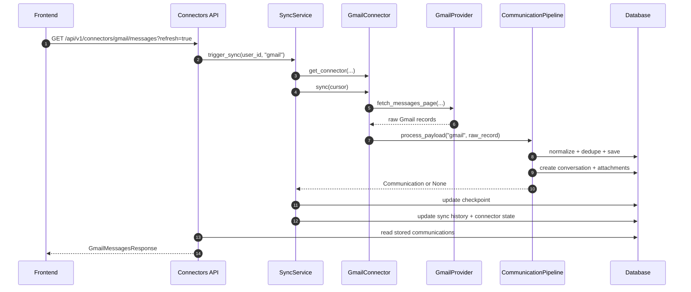
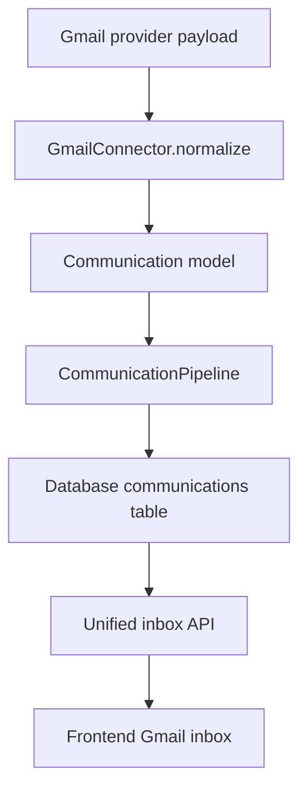
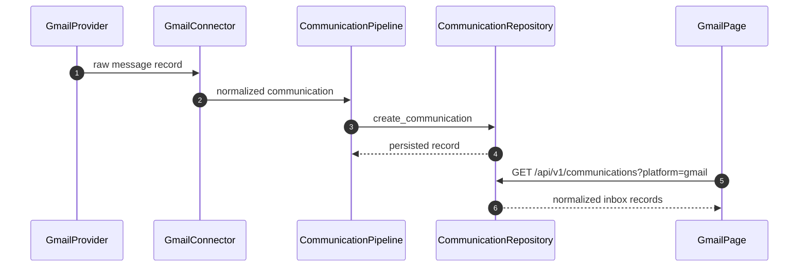
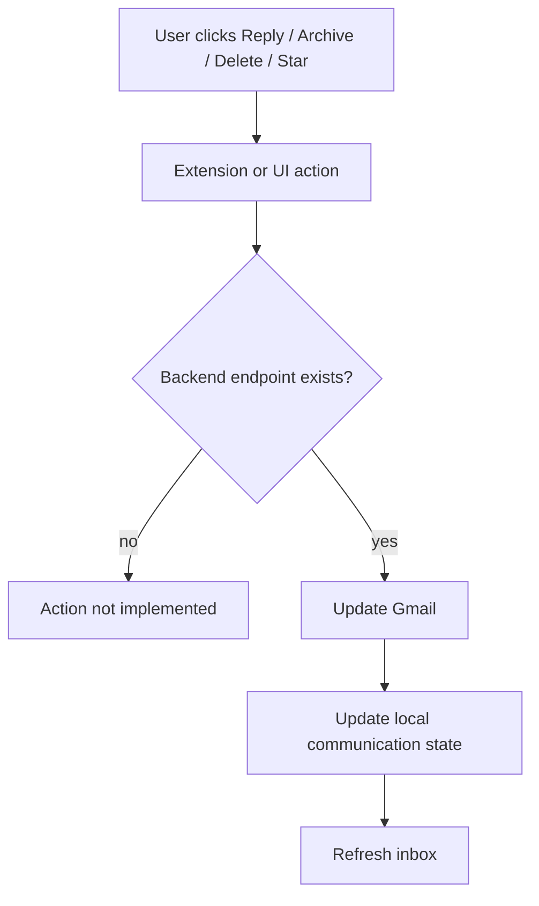
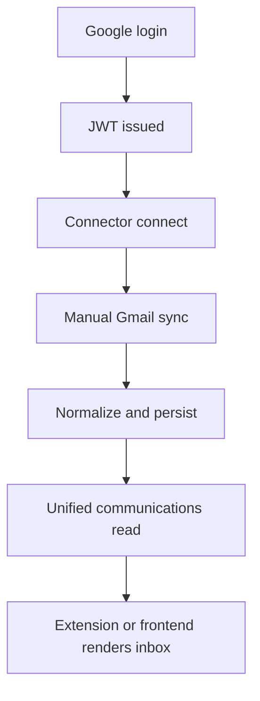
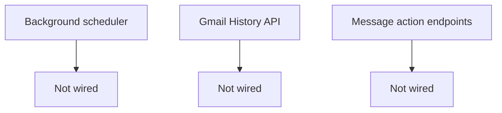

# Gmail Flow Only

## 1. Background Sync Flow

```mermaid
flowchart TD
    A[User opens Gmail UI] --> B[Frontend requests /api/v1/connectors/gmail/messages]
    B --> C{refresh=true?}
    C -- yes --> D[SyncService.trigger_sync]
    C -- no --> J[Read stored messages]
    D --> E[Load connector and credentials]
    E --> F[connector.sync(cursor)]
    F --> G[GmailProvider.fetch_messages_since_history or fetch_messages_page]
    G --> H[Fetch Gmail change set or message list]
    H --> I[Fetch each message detail]
    I --> K[CommunicationPipeline.process_payload]
    K --> L[Normalize]
    L --> M[Deduplicate]
    M --> N[Create conversation]
    N --> O[Persist communication]
    O --> P[Persist attachments]
    P --> Q[Update checkpoint]
    Q --> R[Update sync history]
    R --> S[Return stored Gmail messages]
    J --> S
```



### Current State

- Manual sync exists.
- Incremental cursor checkpoint exists.
- Sync history exists.
- Background sync scheduling is wired through the extension alarm loop.
- Gmail History API incremental sync is implemented in the provider.

## 2. Unified Inbox Flow





### Current State

- Unified inbox reads from `communications`.
- Gmail inbox still has a connector-specific read path for loading and refresh.
- The shared communications table already supports a unified inbox pattern.

## 3. Email Actions Flow



### Current State

- Reply is not implemented.
- Reply All is not implemented.
- Forward is not implemented.
- Archive is not implemented.
- Delete is not implemented.
- Mark Read and Mark Unread are not implemented.
- Star and Unstar are not implemented.
- Label move/update is not implemented.

## 4. Exact Backend Reality




