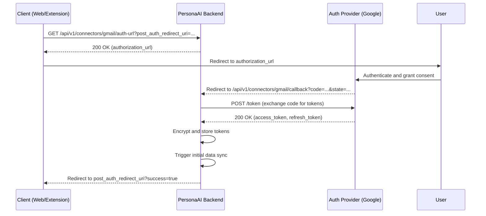

# PersonaAI OAuth 2.0 Architecture

This document outlines the client-aware OAuth 2.0 architecture used by PersonaAI to connect to third-party services like Google. This architecture is designed to be secure, scalable, and support multiple client applications (web, extension, mobile, etc.) from a single backend.

## 1. Core Principle: Client-Aware Redirects

The central concept is that the client initiating the OAuth flow specifies where it wants the user to be redirected after the authentication is complete. This is achieved by passing a `post_auth_redirect_uri` parameter to the backend when requesting the authorization URL.

This approach avoids hardcoding redirect URIs in the backend and allows for a single set of OAuth endpoints to serve any number of clients.

## 2. OAuth Sequence Diagram

## 3. Detailed Flows

### 3.1. Web Dashboard Flow

1.  The user clicks "Connect Gmail" on the dashboard.
2.  The frontend calls `GET /api/v1/connectors/gmail/auth-url` with `post_auth_redirect_uri` set to the dashboard's connectors page (e.g., `http://localhost:3000/dashboard/connectors`).
3.  The backend generates the Google OAuth URL, embedding the `post_auth_redirect_uri` in the signed `state` parameter.
4.  The frontend redirects the user to the Google OAuth URL.
5.  After user consent, Google redirects back to the backend's callback URL (`/api/v1/connectors/gmail/callback`).
6.  The backend validates the `state`, exchanges the `code` for tokens, stores them securely, and starts the initial sync.
7.  Finally, the backend redirects the user to the `post_auth_redirect_uri` extracted from the `state`, which is the dashboard connectors page.

### 3.2. Chrome Extension Flow

1.  The user clicks "Connect Gmail" in the extension's side panel.
2.  The extension's background script calls `GET /api/v1/connectors/gmail/auth-url` with `post_auth_redirect_uri` set to the extension's unique redirect URL, obtained via `chrome.identity.getRedirectURL()`.
3.  The backend returns the Google OAuth URL.
4.  The background script uses `chrome.identity.launchWebAuthFlow` to open the OAuth URL in a new window.
5.  After user consent, Google redirects back to the backend's callback.
6.  The backend performs the token exchange and storage.
7.  The backend then redirects to the `post_auth_redirect_uri`, which is the extension's specific URL. `launchWebAuthFlow` captures this redirect, completes the flow, and returns control to the background script.
8.  The background script can then verify the connector status and update the UI.

### 3.3. Future Mobile/Desktop Flow

A future native mobile or desktop client would follow a similar pattern:

1.  Register a custom URL scheme (e.g., `personaai://`).
2.  Call `GET /api/v1/connectors/gmail/auth-url` with `post_auth_redirect_uri` set to `personaai://oauth/callback`.
3.  Launch the system's web browser to the authorization URL.
4.  After consent, the backend will redirect to `personaai://oauth/callback`, which will launch the native application to handle the callback.

## 4. State Management

The `state` parameter in the OAuth flow is a securely signed JSON blob containing:
- `user_id`: The ID of the user initiating the flow.
- `post_auth_redirect_uri`: The client's desired final redirect URI.
- `issued_at`: A timestamp to prevent replays.

The state is signed with a secret key using HMAC-SHA256 to prevent tampering and ensure its integrity. This also serves as a CSRF protection mechanism.

## 5. Connector Lifecycle

The connector state machine ensures the UI can reflect the current status of each integration:

-   `DISCONNECTED`: The initial state. No credentials stored.
-   `AUTHORIZING`: The state after the user has been redirected to the provider, but before the callback is received.
-   `CONNECTED`: Credentials have been successfully obtained and stored. The connector is ready for use.
-   `SYNCING`: An data synchronization is in progress.
-   `RECONNECT_REQUIRED`: The stored credentials are no longer valid (e.g., token expired or revoked). The user needs to re-authenticate.
-   `ERROR`: An unrecoverable error occurred during connection or sync.

## 6. Security Considerations

-   **CSRF Protection:** The signed `state` parameter ensures that the OAuth callback request originates from the user who initiated the flow.
-   **Credential Storage:** All OAuth tokens (access and refresh) are encrypted at rest using a strong encryption algorithm before being stored in the database.
-   **Token Exchange:** The authorization code is exchanged for tokens on the backend. Tokens are never exposed to the client-side applications (web or extension).
-   **Redirect URI Validation:** While the current implementation accepts any `post_auth_redirect_uri`, a production environment should implement a whitelist of allowed redirect URI prefixes to prevent open redirect vulnerabilities.
